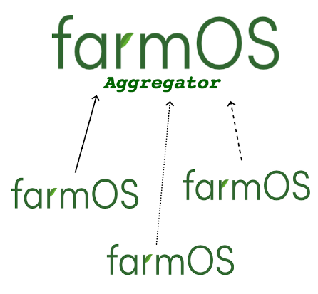

# farmOS-aggregator

  

farmOS-aggregator is an application for interacting with multiple [farmOS](https://farmOS.org)
instances. The application provides a GUI for registering farmOS instances with the Aggregator
and a REST API for interacting with farmOS instances. Depending on how an Aggregator is configured,
farmOS admins will authorize access to only a subset of their farm's data.

farmOS-aggregator is built with:
* [FastAPI](https://github.com/tiangolo/fastapi) for the REST API
* [farmOS.py](https://github.com/farmOS/farmOS.py) client library for querying farmOS instances

For more information on farmOS, visit [farmOS.org](https://farmOS.org).

## Documentation 

 - _**Using** the farmOS-aggregator_: [docs/using-farmos-aggregator.md](docs/using-farmos-aggregator.md)
 - _**Configuring** a farmOS-aggregator_: [docs/configuration.md](docs/configuration.md)
 - _**Deploying** a farmOS-aggregator_: [docs/deployment.md](docs/deployment.md)
 - _**API Documentation**_:  [docs/api.md](docs/api.md)
 - _**Development**_: [docs/development.md](docs/development.md)

## FAQ

#### _What are the motivations for creating farmOS-Aggregator?_

#### _Does this make all of my farmOS data available to the public?_
No.

#### _I have awesome farm data stored in my farmOS server! Are there any Aggregators that I can share my data with?_

## MAINTAINERS

 * Paul Weidner (paul121) - https://github.com/paul121

This project has been sponsored by:

 * [Farmier](https://farmier.com)
 * [Pennsylvania Association for Sustainable Agriculture](https://pasafarming.org)
 * [Our Sci](http://our-sci.net)
 * [Bionutrient Food Association](https://bionutrient.org)
 * [Foundation for Food and Agriculture Research](https://foundationfar.org/)
