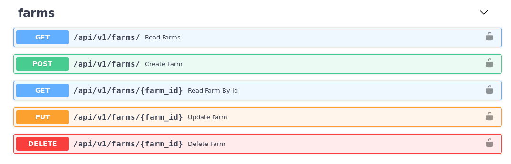
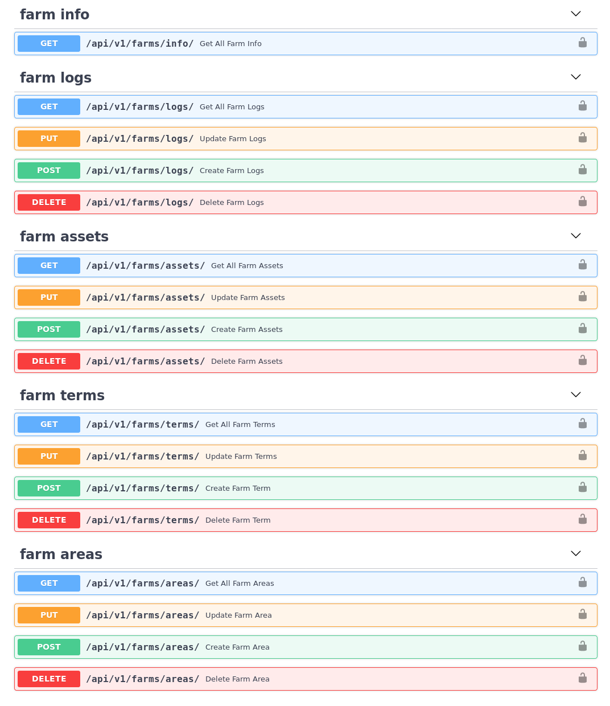
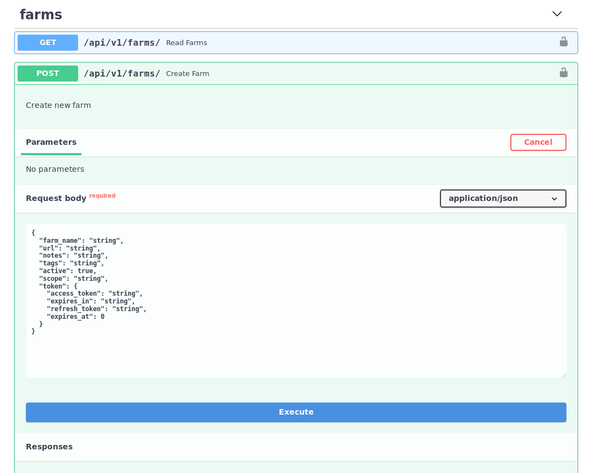
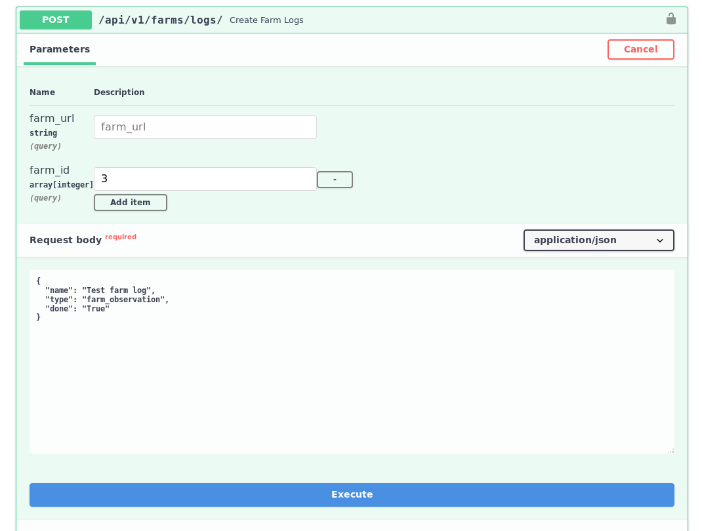

#farmOS Aggregator API Documentation

Thanks to FastAPI, an OpenAPI JSON Schema is provided at [http://localhost/api/v1/openapi.json](http://localhost/api/v1/openapi/json)
This schema is used in the interactive API documentation (provided by Swagger UI) at [http://localhost/docs](http://localhost/docs).
**Note** that to make requests via the Swagger UI, you must login with the `authorize` button in the top right.

Images of the OpenAPI documentation [here](#openapi-api-docs)

## Authentication

The farmOS-Aggregator uses OAuth2 with `Bearer` tokens for authenticating with the REST API. With a registered user
account, the OAuth2 Password Flow may be used to authenticate. Request a token at the
[http://localhost/api/v1/login/access-token](http://localhost/api/v1/login/access-token) endpoint. Make sure to include
the OAuth `scope` you are using to authorize with the API. Some endpoints require one or many authorized `scopes`. See
the interactive API docs for further documentation on required scopes.

Supported scopes:
- `farm:create`
- `farm:read`
- `farm:update`
- `farm:delete`
- `farm:authorize`
- `farm.info`
- `farm.logs`
- `farm.assets`
- `farm.terms`
- `farm.areas`

## Endpoints

farmOS-aggregator provides the following endpoints:

### Connecting farmOS instances

- `/api/v1/farms/`

The root `farms` endpoint is used for managing farmOS profiles. It supports HTTP `GET`, `POST`, `PUT` and `DELETE`
requests.

### Interacting with farmOS instances

- `/api/v1/farms/info`
- `/api/v1/farms/logs`
- `/api/v1/farms/assets`
- `/api/v1/farms/terms`
- `/api/v1/farms/areas`

All of the endpoints used for interacting with farmOS instances are name-spaced from the `/api/v1/farms` endpoint. All
endpoints support HTTP `GET`, `POST`, `PUT` and `DELETE` requests, with the exception of `/farms/info` which only
supports `GET` requests. By default, all endpoints will attempt to run queries on **all** farmOS instances saved in the
aggregator. Passing a list of `farm_id` or a single `farm_url` as a query parameter, with any request, will only
perform actions on the listed farms. For example, a `GET` to `/api/v1/farms/info?farm_id=1&farm_id=5` will only return
the farmOS instance info from farms of ID `1` and `5`. The `farm_id` of farmOS instances can be retrieved with a `GET`
to `/api/v1/farms`.

### Managing farmOS-aggregator users

- `api/v1/users`

farmOS-aggregator users can be added from the GUI or via the API at this endpoint.

### Utility Endpoints

- `api/v1/utils/`

Endpoints under the `/utils` namespace provide various functionalities, primarily for the frontend vue app.
Documentation of each endpoint is provided in the interactive UI. Notable util endpoints:
 - `utils/ping-farms/` attempts to connect to all `active` farm profiles saved in the Aggregator. Because regular
 communication with farmOS servers is required to prevent OAuth Tokens from expiring, this endpoint is useful for
 setting up CRON jobs that auto-ping farmOS servers. A unix CRON job could be schedule to `POST` to this endpoint
 every 12 hours.
 - `utils/farm-registration-link` can be used to generate a link with an embedded `api_token` for registering farm
 profiles. This endpoint is used to generate the link in the admin UI, but may be useful in other 3rd party integrations
 for allowing users to join the Aggregator. When the Aggregator is not configured with Open Farm Registration, farm
 profiles can only be added by the Aggregator admin or someone with a valid registration link.
 - `utils/farm-auth-link` can be used to generate a link to re-authorize a farm profile. Similar to the
 `farm-registration-link`, this endpoint generates a link with an embedded `farm_id` and `api_token`.

### OpenAPI API Docs

Screenshots of autogenerated docs.

CRUD endpoints for managing farmOS server profiles.

All farmOS related APIs for interacting with records are listed under the `farm` tag prefix.

The OpenAPI docs are interactive, allowing to perform requests from the "Try it out" button. This displays the fields
required to perform requests at each endpoint.

`GET` farm info.

`POST` a sample log to farm ID #3.