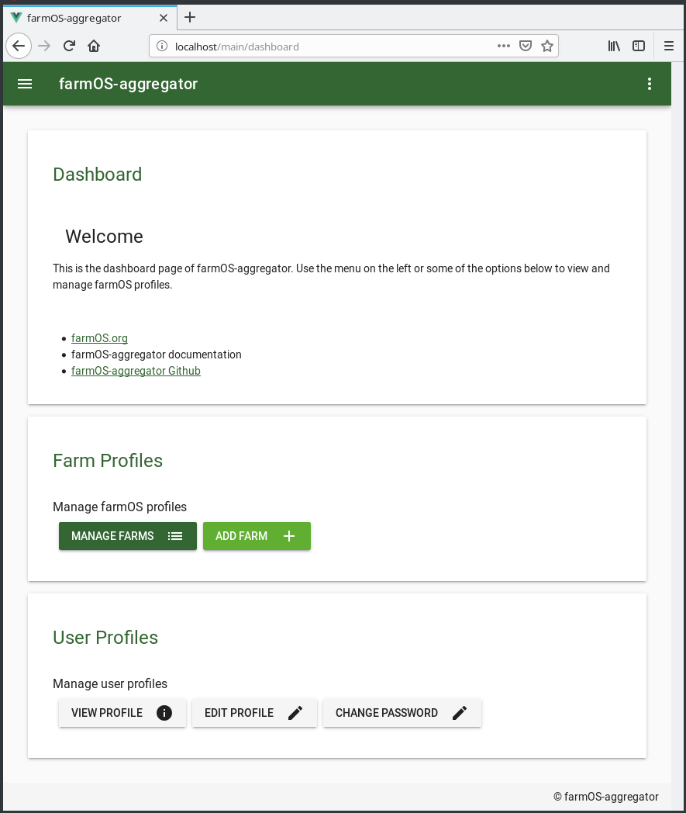
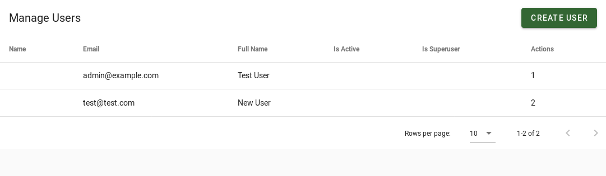
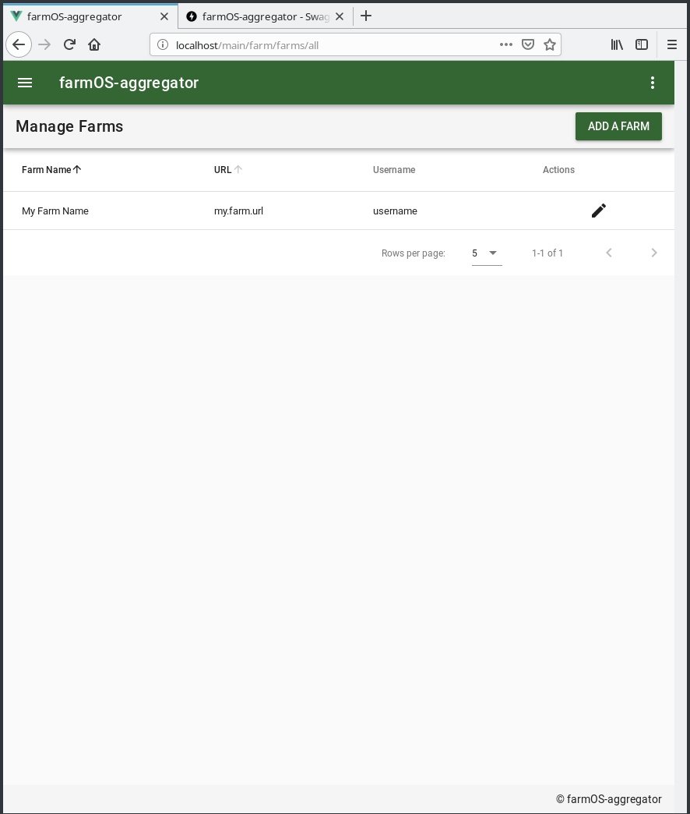
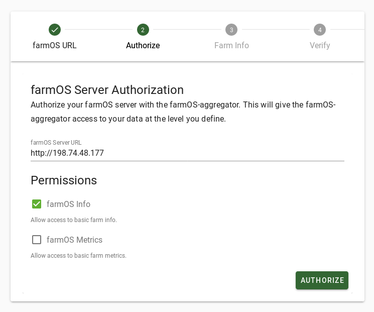

# Using farmOS Aggregator

This page documents features of the Admin UI provided at [http://localhost/dashboard](http://localhost/dashboard)

## Managing farmOS Aggregator Users

## Managing Farm Profiles

TODO: Update this to new screenshot without `username`

## Registering Farm Profiles

The Public Registration page allows farmOS admins to select which of the configured OAuth scopes they would like to
authorize the farmOS Aggregator with access to their data.

## Re-Authorizing Farm Profiles

TODO: Add screenshot showing re-authorization process.

