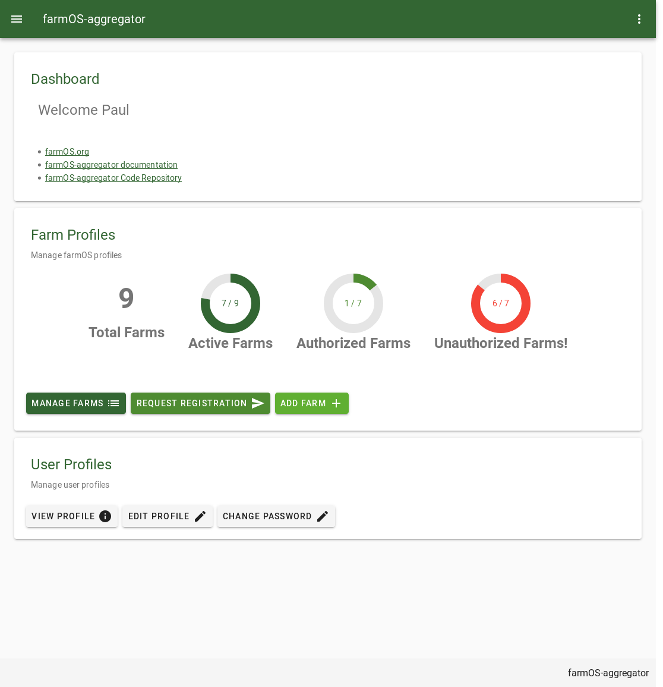
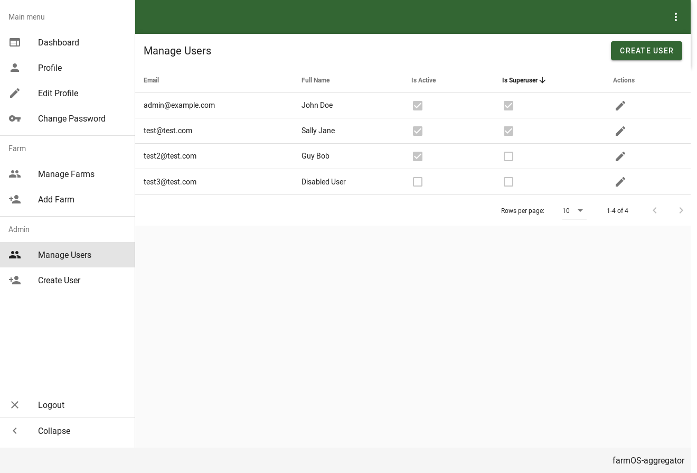
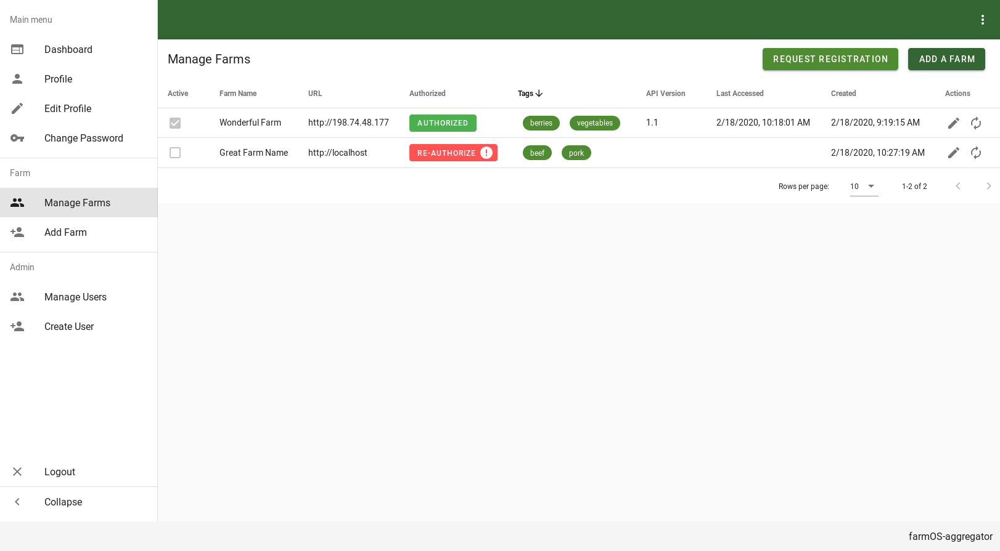
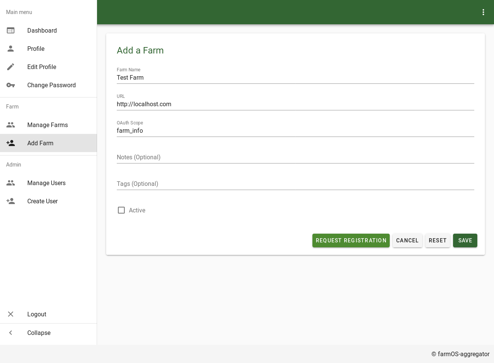
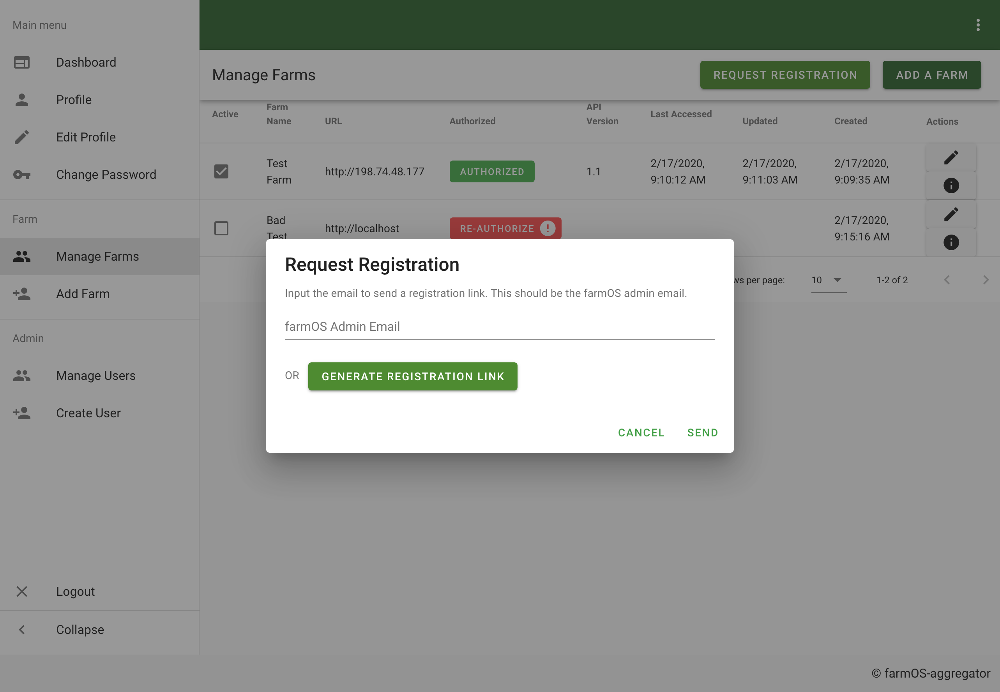
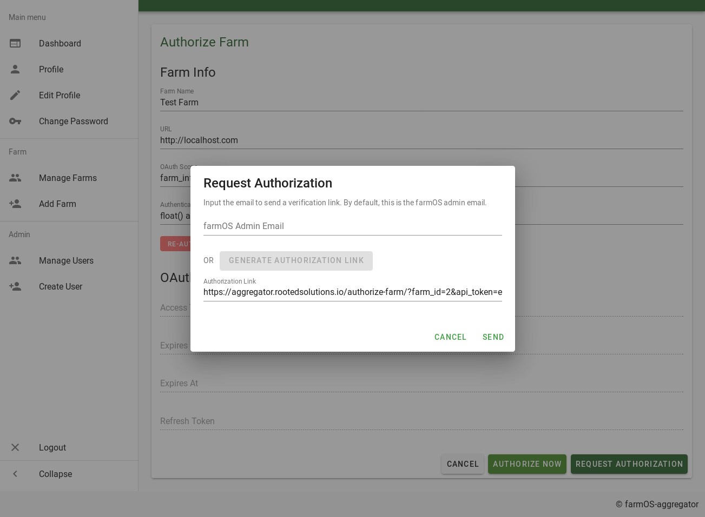
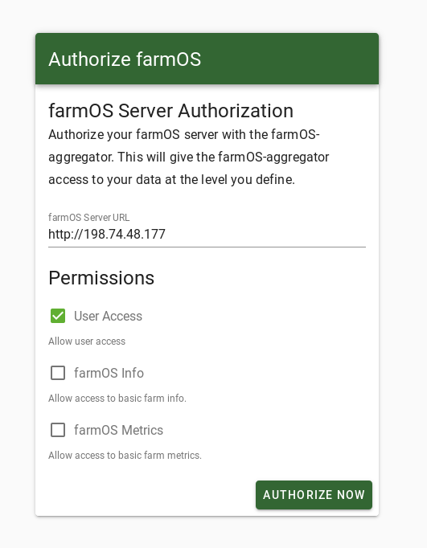

# Using farmOS Aggregator

- [Dashboard](#dashboard)
- [Managing farmOS Aggregator Users](#managing-farmos-aggregator-users)
- [Managing Farm Profiles](#managing-farm-profiles)
  - [Add Farms](#add-farms)
    - [Registering Farm Profiles](#registering-farm-profiles)
    - [Requesting Registration](#requesting-registration)
  - [Authorizing Farm Profiles](#authorizing-farm-profiles)
    - [Requesting Authorization](#requesting-authorization)
    - [Authorization Form](#authorization-form)
  
See [configuration](./configuration.md) on how to configure farmOS Aggregator.

## Dashboard

A dashboard with an overview of information is available at [http://localhost/dashboard](http://localhost/dashboard)

Features:
- Displays simple stats showing the total number of farms, active farms, and authorized farms. Useful to quickly see if
any farms have become unauthorized.

## Managing farmOS Aggregator Users

## Managing Farm Profiles

Features:
- Lists all farm profiles in a sortable table
- Sort by the farm `active` flag
- Displays the `authorization` status of the farm.
  - Hover over the `re-authorize` button to see the error.
  - Click on the authorized status button to see more info on the __ page.
- Displays `last_accessed` and `created` times.
- Button to `edit` the farm profile - see edit farms.
- Button to quickly refresh `farm info`. This is useful to diagnose connection problems.

### Add Farms

Features:
- Add a farm profile to the aggregator. _Note that you can only pre-populate values for the farm_ - **_You will not be able
to connect to the farm after adding via the admin UI_**
- After adding, the farm must be `authorized` by requesting authorization from the farmOS server admin.
- The `active` flag can be configured when adding a farm.

#### Registering Farm Profiles

The registration page allows farmOS admins to select which of the configured OAuth scopes they would like to
authorize the farmOS Aggregator with access to their data.

Features:
- If `OPEN_FARM_REGISTRATION` is enabled then this page will be accessible to the public. The 
`FARM_ACTIVE_AFTER_REGISTRATION` setting allows you to configure if registered farms will be enabled by default. This
can be useful to prevent the malicious intent if many farm profiles are added.
- If `INVITE_FARM_REGISTRATION` is enabled then this page will be accessible to users that receive a link with an
embedded `api_token`. See _[Requsting Registration](#requesting-registration)_
- The registration is multi step process (step 2 is show above):
  1) farmOS Server Hostname is input
  2) User selects which of the configured OAuth Scopes they want to authorize
  3) The user is redirected to their farmOS server to complete the OAuth Authorization Flow
  4) Basic farm values are pre-populated in the registration form. The user verifies their information.

#### Requesting Registration

Features:
- Aggregator admins can _request registration_ by generating a special link users can use to join the aggregator.
- An email can be supplied to automatically send an email requesting registration OR
- The link can be generated and copy/pasted to share with the user manually.

### Authorizing Farm Profiles

Authorization is a crucial part of the farmOS Aggregator. Because farmOS server `usernames` and `passwords` are not 
saved in the database, access to farmOS servers must be _authorized_ via the OAuth2 Authorization protocol. There are a
few instances when authorization may be required of users:
- After manually adding a farm via the admin UI
- If communication with the farmOS server is ever broken for an extend amount of time, the existing authorization could
expire. The server must then be _re-authorized_
- If the Aggregator ever wants to request that users authorize with new or additional OAuth Scopes, then admins must 
request users to _re-authorize- with those additional scopes.

#### Requesting Authorization

Features:
- Aggregator admins can _request authorization_ of a farmOS server by generating a special link users can use to
authorize their farmOS server. **_This link is unique to each individual farm profile. It should only be shared with
the owner of that farmOS server_**
- An email be supplied to automatically send an email to the farmOS admin (if provided, this will default to the email
saved in the farm profile)
- The link can also be generated and copy/pasted to share with the user manually.

#### Authorization Form

This is the form that users are directed to with the generated authorization links.

- Authorization is a 3 step process:
  1) User selects which of the configured OAuth Scopes they want to authorize
  2) The user is redirected to their farmOS server to complete the OAuth Authorization Flow
  3) The user is redirected to the Aggregator showing that the authorization was successful.
